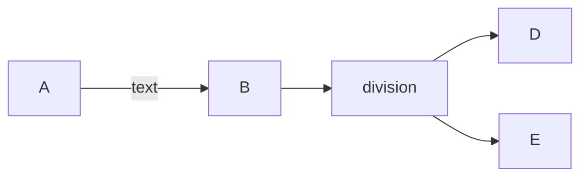

+++
title = "Markdown de gráficos"
+++

### Mermaid

Mermaid sirve para hacer esquemas de forma sencilla




Los cuales al realizarlos tienen un efecto visual acojedor


graph LR
A --textoo--> B
B --> C
C[division] --> D
C --> E


---

### Datawrapped

También se puede utilizar **Datawrapper** es una herramienta en línea que permite crear gráficos interactivos

```markdown
<iframe src="https://datawrapper.dwcdn.net/3uu5F/1/" width="600" height="400"></iframe>
```

Los cuales simplemente tienes que subir y copiar la url para que se vea así el la página:

<iframe src="https://datawrapper.dwcdn.net/3uu5F/1/" width="600" height="400"></iframe>

--- 

### Gráfico con biblioteca Plotly

Se peuden realizar gráficos interactivos en la propia página de la siguiente forma

```markdown
<div id="plotlyChart"></div>

<script>
  var trace1 = {
    x: ['Enero', 'Febrero', 'Marzo', 'Abril', 'Mayo', 'Junio'],
    y: [10, 20, 30, 40, 50, 60],
    type: 'bar'
  };

  var data = [trace1];

  Plotly.newPlot('plotlyChart', data);
</script>
```

Para luego poder verse así:

<div id="plotlyChart"></div>

<script>
  var trace1 = {
    x: ['Enero', 'Febrero', 'Marzo', 'Abril', 'Mayo', 'Junio'],
    y: [10, 20, 30, 40, 50, 60],
    type: 'bar'
  };

  var data = [trace1];

  Plotly.newPlot('plotlyChart', data);
</script>

---