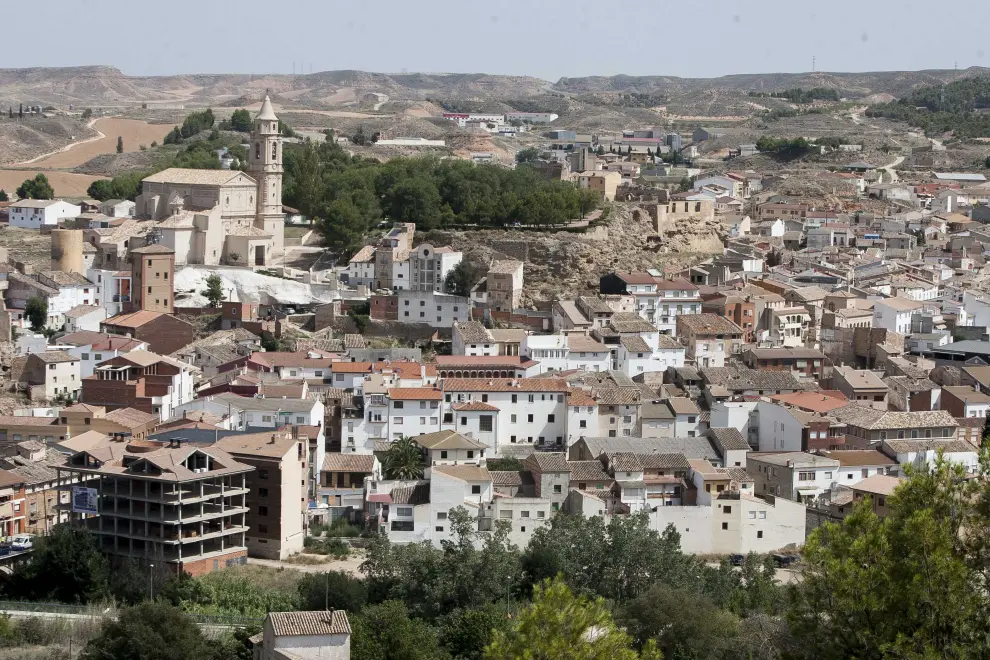
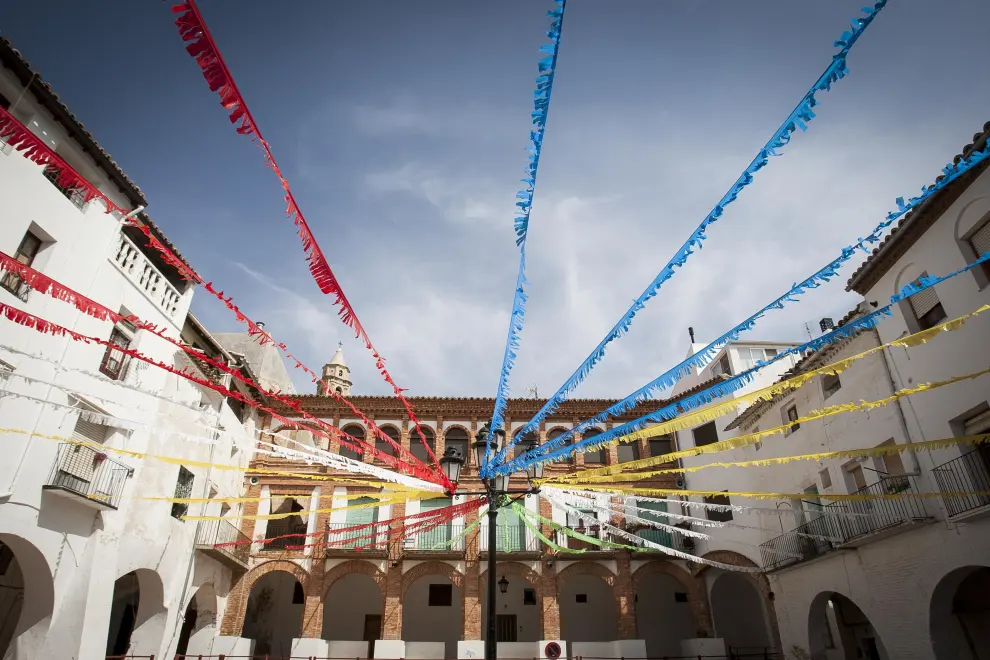
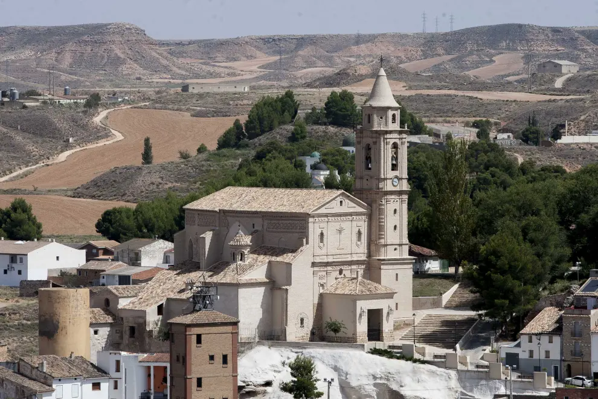
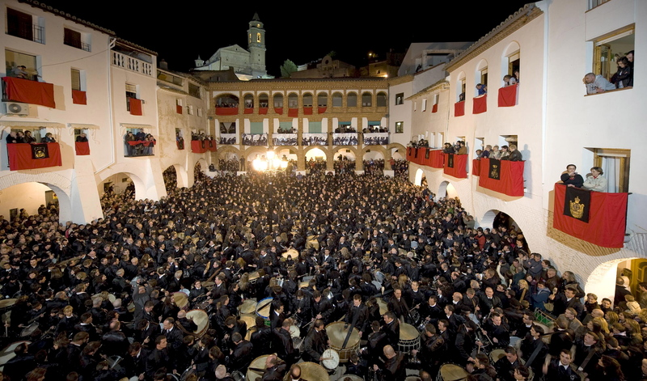

+++
title = "LA VILLA DE HÍJAR"
+++


,,


*El maravilloso pueblo de Híjar ubicado en Teruel, España.*

## HISTORIA

La historia de **Híjar** está relacionada con la de su señorío.
**Jaime I de Aragón**, el Conquistador, nacido en 1208 y muerto en Valencia en 1276, rey de Valencia y de Mallorca,
fue el responsable de recuperar el señorío de la ciudad instituyendo la Baronía de Híjar en el año 1267 para su hijo.  
Los Reyes Católicos elevaron el Señorío de Híjar a **Ducado** en el año 1483 y en 1708, el rey **Felipe V**,
le concedido el título de **«Muy Noble y Leal Villa»**.

## UBICACIÓN (Como llegar)
| Origen - Destino    |    Tiempo    |         Distancia |
|:--------------------|:------------:|------------------:|
| Teruel a Híjar      | 1 h y 58 min |            151 km |
| Zaragoza a Híjar    | 1 h y 2 min  |           75,4 km |
| Valencia a Híjar    | 3 h y 10 min |            265 km |
| Castellón a Híjar   | 2 h y 34 min |            197 km |
| Barcelona a Híjar   | 3 h y 1 min  |            317 km |
| Madrid a Híjar      | 3 h y 46 min |            385 km |  
  

## CULTURAS DEL PUEBLO
En un recorrido por las calles y plazas de nuestro pueblo el visitante podrá encontrar  restos de **tres culturas** que convivieron en Híjar durante años.

  
CULTURA CRISTIANA (ver más)

***BARRIO DE LOS CRISTIANOS***  
La presencia Cristiana en Híjar, plantea las mismas dudas que el resto de religiones. Tenemos que esperar hasta la Edad Media para poder garantizar la presencia de los cristianos en la Villa de Híjar.

La necrópolis visigoda de “Las Vales”, datada hacia el siglo VI de nuestra era, nos da a entender que ya había cristianos asentados en la Villa viella de Ixar. Con anterioridad, y a pesar de disponer en el municipio de yacimientos tardoibéricos y romanos, la falta de estudios y de excavaciones arqueológicas, nos ha impedido conocer nada a cerca de los usos y costumbres de estos pobladores.

El periodo entre el siglo VIII y el siglo XII, coincide con la dominación islámica. Y volvemos a tener el mismo problema. De entre las pacificas gentes que habitaban Híjar, seguro que había cristianos (y por supuesto judíos y musulmanes) pero no nos ha quedado de ellos ningún resto, ni arqueológico ni documental.

Con la reconquista de Híjar por El Batallador, entre 1118 y 1119, comenzaron los flujos migratorios desde el norte del reino, quedando consolidada la frontera a mediados del siglo XIII. Los cristianos viejos, procedentes del sur de Francia y del norte del reino de Aragón, se asentaron en la Plaza de la Villa y las calles adyacentes de Aínsa, Jardiel, Otal y Dosset. Apellidos como Bernad, Royo, Bielsa o Laborda, aparecieron en época en la Villa de Híjar.

En el siglo XIV, ya tenemos certezas a cerca de los cristinos de Híjar. En 1300, Doña Marquesa Gil de Rada (hija, esposa y madre de cruzados), funda el Convento de Nuestra Señora de los Ángeles de Híjar. Se inicia la construcción de la iglesia parroquial de Santa María la Mayor. Se construye el Hospital y la Ermita de la Santa Cruz. En 1313, se constituye la cofradía del Rosario.

En el siglo XVI, se articula la celebración de la Semana Santa, con la llegada de los Franciscanos al Villa. También en este siglo se edifica la Iglesia de San Blas. En 1660 se edificaba la ermita del Santo Sepulcro en el cabezo de la cruz.

Desde el siglo XVIII hasta la actualidad, se ha constituido la Cofradía del Rosario (los rosarieros), se han comenzado a procesionar los Via crucis y las romerías y se ha adquirido el rosario de cristal (los farolicos). La ermita del Carmen, se sumó al patrimonio local y espiritual de la localidad.

Gran cantidad de monumentos y tradiciones, de las cuales algunas se han perdido, otras se han recuperado y otras se han mantenido. Ocho siglos de historia y de tradiciones que marcan la idiosincrasia del pueblo hijarano.

  
CULTURA JUDÍA (ver más)

***EL RECINTO MELLAH O BARRIO JUDIO***
Se conserva bien en un arrabal que se cierra sobre la plaza de san Antón, dónde se sitúa la sinagoga – de finales de la Edad Media- hoy convertida en ermita de san Antón.
El origen de los judíos hijaranos, es incierto y carecemos de información definitiva. Es más que probable que, aunque existentes con anterioridad, se constituyeran en aljama, tras la fundación del señorío de Híjar en el siglo XIII.

La judería de Híjar, se articula en torno a la plaza de San Antón, y las calles contiguas de la Fuente, Jesús y Azaguan. Como judería que era, disponía además de su propio horno, carnicería, su baño ritual o “miqwe”, el “fossar” y escuela talmúdica.

Las primeras referencias que tenemos de su presencia, es a raíz del indulto que Alfonso IV, concede a unos judíos fabricantes de seda. Estos son trasladados a Híjar a instancia de doña Teresa de Alagón

En 1410, el adelantado de la aljama de los judíos, escribía al arzobispo de Zaragoza para solicitarle permiso para ampliar la sinagoga. Relevante información por lo que representa y por quien la firma, AÇach Chinillo, patriarca de la familia de los Chinillo que, convertidos al cristianismo, tomaron el apellido Santangel. Varios censales del siglo XV, signados por la aljama de judíos de Híjar, nos invitan a pensar que en este siglo, vivían en ella al menos 150 almas.

El primer Duque de Híjar, protegió especialmente a los judíos. La imprenta del palacio ducal debieron de atenderla ellos, porque en Híjar entre 1485 y 1490 tres rabinos imprimieron varios incunables en caracteres hebraicos.

A raíz del decreto de expulsión, los Duques de Híjar siguieron protegiendo a sus vasallos; retrasando, según citan algunas fuentes, hasta 1530, fecha en la que el emperador Carlos V, les recordó el decreto de expulsión. Representativo de esta protección, es la pensión que deja el duque de Híjar en su testamento de 1517, a la viuda del Rabí.

  
CULTURA ÁRABE (ver más)

***EL BARRIO MORISCO***
Desde la carretera vieja, hasta el barrio de San Blas, extendido sobre un pequeño valle, con la mezquita, después iglesia de la Magdalena. En esta parte del recorrido se aprecian edificios civiles como la casa del ‘Justicia’ en la misma plaza de San Blas.

La llegada de los musulmanes a la península ibérica, y por definición a Híjar, esta bastante bien definida. Sin embargo, a cerca de su modo de vida, sus nombres o sus tradiciones, pocas cosas nos han quedado.

El desembarco de los musulmanes en la península ibérica, se produjo en el 711. Ante la pasividad, el desconcierto y la desorganización de los reyes visigodos, en el año 720, habían conquistado toda la península. El asentamiento se produjo buscando los cauces fluviales; en el Bajo Aragón, los ríos Aguasvivas, Martín y Guadalope, fueron los cauces elegidos para asentarse. Topónimos como Alcañiz, Albalate dan buena muestra de ello.
Los estudios realizados, atestiguan que en la plaza del castillo se instaló un castillo o qalat de época islámica. A su vez, uno de los torreones que lo rodeaban, que presenta una factura almohade, data del siglo XI.

Estos se afincaron en la zona sur del pueblo. La plaza de la parroquia y las calles adyacentes, constituyeron la aljama de los moros. De esta zona, el único resto que queda de esta época, son los muros de la antigua puerta que cobija la capilla-arco de la Virgen de Arcos, y el nombre de la calle contigua a la capilla. A través de esta puerta, se iniciaba el camino; que por el río, comunicaba la Villa de Híjar con la de Urrea de Gaen.

En 1495, en el fogaje que encargo Fernando II, aparecen en el reseñadas 40 familias u hogares; lo que supone una población de unas 200 personas. Y al otro lado del camino, en Urrea de Gaen, eran 52 hogares.

Sin duda, la mayor aportación de los musulmanes a la villa de Híjar, y que se conserva en la actualidad, es el sistema de regadío de la huerta. Los musulmanes introdujeron su sabiduría y sus aportaciones resultarían decisivas para el desarrollo social en la edad media. Introdujeron nuevos cultivos como los cítricos y el arroz. Técnicas como la rotación de cultivos o la siembra estacional. Pero sin ningún genero de dudas, la principal aportación fue el regadío. La conducción de las aguas a través acequias, con el fin de irrigar los campos. Las azudes, para retener y desviar el agua de los ríos. El Ador, que es el turno de riego que vigilante contempla el zabaceicas.

Durante el siglo XVI y hasta su expulsión en 1610, las dos universidades vivieron de forma paralela su día a día. Soportaban cargas impositivas diferentes y solían tener discusiones por los derechos de paso o por las tierras. Esta situación toco a su fin en 1702, cuando se unificaron las dos universidades en una sola.

## SEMANA SANTA

##### ***Ruta del tambor y el bombo***
Se cuenta que los tambores de la zona del Bajo Aragón datan de épocas medievales y están relacionados con el mundo militar. Leyendas e historias cuentan versiones sobre este acontecimiento festivo y cultural. Este ayuntamiento forma parte de la Ruta del Tambor.  
En la lista que forma este grupo están los siguientes:
- Albalate del Arzobispo
- Alcañiz
- Alcorisa
- Andorra
- Calanda
- Híjar
- La Puebla de Híjar
- Samper de Calanda
- Urrea de Gaén

##### ***V Centenario Semana Santa Híjar*** 

El año 1519 Don Luis Fernández de Ixar y Arellano, 4º duque de Híjar fundó y dotó en Híjar un convento de frailes Franciscanos. A ellos encargó la organización de la Semana Santa. Celebramos a lo largo de este año y hasta la próxima Semana Santa el V Centenario de este hecho.

Independientemente de su origen, es innegable la impronta franciscana en la Semana Santa de Híjar: el paraje del Calvario a semejanza del Monte Carmelo. La túnica, de riguroso negro con el tercerol para cubrir la cabeza en los actos religiosos. El cordón y el escapulario de san Francisco que peaneros, Ministros y Ministras deben portar de manera obligada. En última instancia, la “sumisión” de un instrumento como el tambor en los actos religiosos.

La Orden Tercera seglar creada por los Franciscanos, sigue aún hoy dirigiendo y cuidando el desarrollo de las procesiones y demás actos litúrgicos.

Contamos con fotografías antiguas (algunas del siglo XIX) que son testimonio de esta celebración, grabaciones de TV y recortes de prensa en los que la Semana Santa aparece reflejada.

Las tradiciones perviven porque no son estáticas, se acomodan a los tiempos como única manera de seguir celebrándose. Muchas cosas han cambiado en la Semana Santa de Híjar –desde la tela con la que se confeccionan las túnicas hasta la caja y la piel de los tambores- pero su esencia sigue siendo la misma: la pasión de todo un pueblo que cada primavera se vuelca en la celebración de este rito ancestral.

Los hijaranos son conscientes de ser eslabones de una cadena donde el recuerdo de los que nos antecedieron se mantiene vivo mientras transmitimos a los que nos suceden el valor y el disfrute de esta celebración comunitaria. Cuando se recibe un patrimonio como este se recibe también la responsabilidad de mantenerlo y cuidarlo en el tiempo.